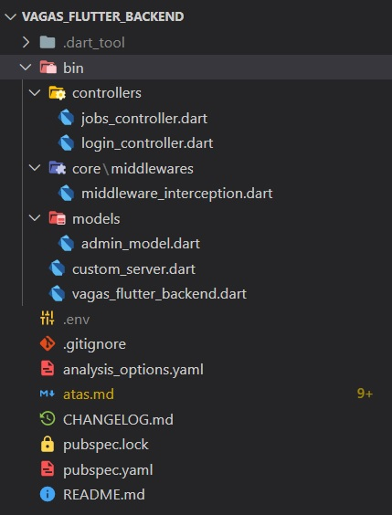
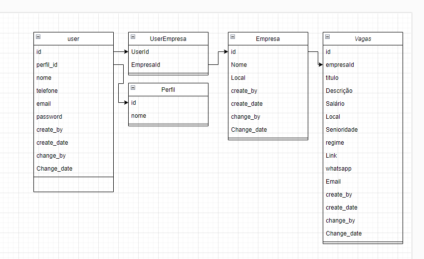

# Ata de Reunião 01 de março de 2023 - 19h-20h30

## Presentes

- [x] Luan Fonseca
- [ ] Raquel
- [x] Leonardo
- [ ] Pedro

## Informes

- Foi repassado o fluxo de trabalho para criação das tarefas e branchs a partir do boards do GitHub Projects

1. Criação do card que descreve a sua tarefa - Se atribua a tarefa , detalhe minimamente o que a sua tarefa engloba
2. Criação da branch a partir da sua tarefa criada
3. implementação local da sua tarefa
4. Testar o funcionamento da sua implementação e commitar no repositório local.
5. Pelo Github criar o Pull Request da sua implementação  (Atenção em posicionar a branch dev como receptora do pull request) - Citar alguém do time como Revisor da sua implementação
6. Confirmar o merge
7. Atualizar a branch local - git pull

### Atividades

- [x] Instalação das dependências
  - [x] [shelf 1.4.0](https://pub.dev/packages/shelf)
  - [x] [shelf_router 1.1.3](https://pub.dev/packages/shelf_router)
  - [x] [dart_jsonwebtoken](https://pub.dev/packages/dart_jsonwebtoken)
  - [x] [mysql1](https://pub.dev/packages/mysql1)
  - [x] [dotenv](https://pub.dev/packages/dotenv)

- [x] Criação do Servidor

```dart
class CustomServer {
  Future<void> initialize({
    required Handler handler,
    required String address,
    required int port,
  }) async {
    await shelf_io.serve(handler, address, port);
    print('Servidor inicializado -> http://$address:$port');
  }
}
```

# Ata de Reunião 03 de março de 2023 - 19h-20h30

## Presentes

- [x] Luan Fonseca
- [x] Raquel
- [ ] Leonardo
- [ ] Pedro

## Informes

- Foi pensada a implementação da metodologia **SCRUM** nas seguintes aborgadens:
- SEGUNDA 19h - *Planning*
  - Planejamento das tarefas desenvolvidas na semana.
- QUARTA 19h - *Alinhamento*
- SEXTA 19h - *Review*
- Todos os dias (de segunda a sexta feira) *reports* diários com resposta as perguntas:

```Report
1- O que eu fiz ontem?
2- O que eu vou fazer amanhã?
3- O que me impede de fazer?
```

**Relembrando do fluxo de Atribuição as tarefas pelo GitHub Projects**
**Inicio dos reportes à partir da 2° Sprint (13/03)**

### Atividades

- Foi implementada a utilização do dotenv contendo as variaveis de ambiente do projeto

```dart
void main() async {
  var env = DotEnv(includePlatformEnvironment: true)..load();

  await CustomServer().initilize(
    handler: (request) => Response.ok('hello world'),
    address: env['address'] ?? 'localhost',
    port: int.parse(env['port'].toString()),
  );
}
```

- **Cada desenvolvedor terá um arquivo `.env` com as variáveis no ambiente de desenvolvimento local**.

# Ata de Reunião 06 de março de 2023 - 20h-21h30

## Presentes

- [x] Luan Fonseca
- [x] Raquel
- [x] Leonardo
- [ ] Pedro

## Informes

- Foi orientada a criação do arquivo `.env` com as variáveis de ambiente compartilahdas entre os desenvolvedores
  
```address=localhost
port=8080
db_host=191.252.185.206
db_port=3306
db_user=comunidade
db_pass=Elite37
db_schema=dev_vagas
```

**Inicio dos reportes à partir da 2° Sprint (13/03)**

### Atividades

- Foi implementada a construção de duas rotas diretamente na função `main()`
- [x] **POST** /login
- [ ] **GET** /jobs
- Foi criada `Pipeline` para adição do midlleware `logRequests`

```dart
void main() async {
  var env = DotEnv(includePlatformEnvironment: true)..load();

  final router = Router();
  router.post('/login', (Request request) async {
    final body = await request.readAsString();
    return Response.ok(body, headers: {'content-type': 'application/json'});
  });

  router.get('/jobs', (Request request) async {
    return Response.ok('Lista de vagas');
  });

  final pipeline = Pipeline().addMiddleware(logRequests()).addHandler(router);

  await CustomServer().initilize(
    handler: pipeline,
    address: env['address'] ?? 'localhost',
    port: int.parse(env['port'].toString()),
  );
}
```

### Para Quarta-feira 08/03

- [ ] Criação dos *Controllers* - Remoção das rotas instanciadas diretamente no método `main()`
- [ ] Criação de middleware global - Mime Type `content-type: application/json`

# Ata de Reunião 08 de março de 2023 - 19h-20h30

## Presentes

- [x] Luan Fonseca
- [ ] Raquel
- [ ] Leonardo
- [ ] Pedro

## Informes

**Inicio dos reportes à partir da 2° Sprint (13/03)**

### Atividades

- Roteiro de atividades preparadas na reuniao de 06/06
- [x] Criação dos *Controllers* - Remoção das rotas instanciadas diretamente no método `main()`
- [x] Criação de middleware global - Mime Type `content-type: application/json`

- Implementações
- [x] Foram criados diretórios para divisão dos arquivos no projeto

- controllers
- core/ middlewares
- models



- Foi implementada a construção das rotas
- [x] **POST** /login
- [x] **GET** /jobs
- [x] Foi criado `middleware` para adição do Mime-types `application/json`
- [x] Foi criado modelo de administrador para representar um recrutador



```dart
class MiddlewareInterception {
  Middleware get appJson => createMiddleware(
        responseHandler: (Response response) => response.change(
          headers: {'content-type': 'application/json'},
        ),
      );
}
```

### Para Sexta-feira 10/03

- [ ] Criação do modelo de jobs
- [ ] Criação do contrato de serviço genérico - para busca de dados
- [ ] Implementação do método `findAll()` do contrato - retorna lista de vagas
- [ ] Criação do contrato de segurança JWT
- [ ] Implementação do contrato de segurança JWT